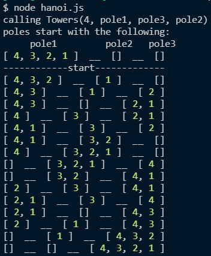

# Solve Towers of Hanoi using JavaScript and Recursion

## Solve the classic Towers of Hanoi using recursion
Rules:
* Can only move one disc at a time to any of the poles
* The disc underneath cannot be smaller than the one above it
* In this case, given an array of "discs" or descending integer elements, use recursion to move elements from one array to a final array, using an auxiliary array as support.

Goal: 
* Move all discs at one pole to another pole

What you are given:
* Three arrays: `pole1, pole2, pole3`
* A helper function to initialize `pole1`
* Skeleton code for `Tower`. This will be called at the end and the result should resemble the comment at the end of `hanoi.js`

Run the js file via `node hanoi.js` and check out the console!

Example:
Tower(numDisc, from, to, spare)
Calling `Tower(4, pole1, pole3, pole2)` should move elements from `pole1` to `pole3` while following the rules.
```
Starting state of each pole array:
pole1 = [4, 3, 2, 1] 
pole2 = []
pole3 = []

End Result:
pole1 === []
pole2 === []
pole3 === [4, 3, 2, 1]
```

In the terminal (note that each element per corresponding array will always be smaller than the element befoer it):



## For future:
Add helper function to test whether the array contents are valid eg: During computation, an array === [2, 3] is not valid, because 2 is smaller than 3 and the array elements should be decrementing.

### Notes: 
Solved folder will be released by 10/31/2021.